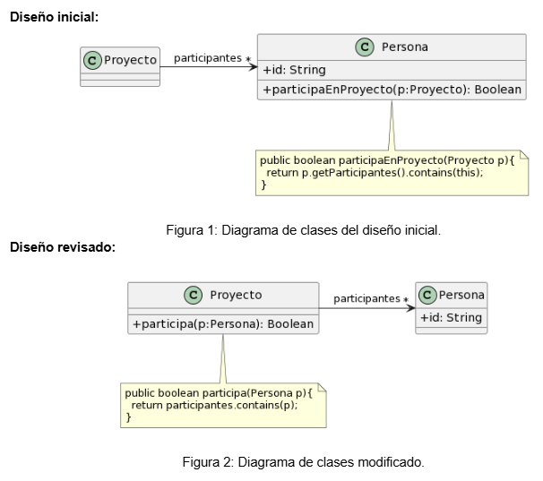

# Ejercicio 1
## 1.1 Protocolo de Cliente
Mejora del protocolo de la clase `Cliente`:

```java
/** 
* Retorna el límite de crédito del cliente
*/
public double limiteDeCredito() {...}

/** 
* Retorna el monto facturado al cliente desde la fecha f1 a la fecha f2
*/
protected double montoFacturadoEntreFechas(LocalDate f1, LocalDate f2) {...}

/** 
* Retorna el monto cobrado al cliente desde la fecha f1 a la fecha f2
*/
private double montoCobradoEntreFechas(LocalDate f1, LocalDate f2) {...}
```
La mejora radicó en la correccion de los nombres de los metodos implementados, ya que no nos daban la informacion suficiente de que hacia un mensaje.

## 1.2 Participacion en Proyectos

Los cambios que se le hicieron a la clase `Proyecto` y `Persona` fue que se movio el metodo `participa(p: Persona): Boolean` a la clase `Proyecto` donde corresponde mas el uso de ese metodo, debido a que se necesita una persona como parametro y asi se sabe los participantes de un proyecto.

## 1.3 Cálculos 
**Codigo**
```java
public void imprimirValores() {
	int totalEdades = 0;
	double promedioEdades = 0;
	double totalSalarios = 0;
	
	for (Empleado empleado : personal) {
		totalEdades = totalEdades + empleado.getEdad();
		totalSalarios = totalSalarios + empleado.getSalario();
	}
	promedioEdades = totalEdades / personal.size();
		
	String message = String.format("El promedio de las edades es %s y el total de salarios es %s", promedioEdades, totalSalarios);
	
	System.out.println(message);
}
```
### Code Smells detectados
- **Long Method**: El método `imprimirValores` es muy largo y realiza muchas tareas, se podría dividir en métodos más pequeños.
- **Reinventar la rueda**: Se podria utilizar `stream()` para recorrer la lista de personal de la empresa
- **Nombre de metodo poco aclarativo**: El metodo `imprimirValores()` no nos dice con detalle cuál es su funcion, sino que responde a un mensaje generico.
- **Uso de variables temporales que no aportan valor**: Las variables `totalEdades` y `totalSalarios` son varaibles que podrian ser eliminadas y con la creación de metodos privados implementar el mismo funcionamiento.