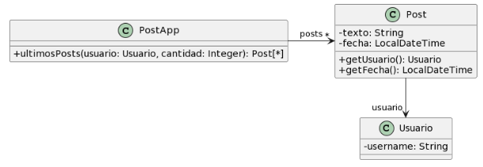

# 2.3 Publicaciones
## UML


## Codigo `ultimosPosts()`
```java
/**
* Retorna los últimos N posts que no pertenecen al usuario user
*/
public List<Post> ultimosPosts(Usuario user, int cantidad) {
        
    List<Post> postsOtrosUsuarios = new ArrayList<Post>();
    for (Post post : this.posts) {
        if (!post.getUsuario().equals(user)) {
            postsOtrosUsuarios.add(post);
        }
    }
        
   // ordena los posts por fecha
   for (int i = 0; i < postsOtrosUsuarios.size(); i++) {
       int masNuevo = i;
       for(int j= i +1; j < postsOtrosUsuarios.size(); j++) {
           if (postsOtrosUsuarios.get(j).getFecha().isAfter(
     postsOtrosUsuarios.get(masNuevo).getFecha())) {
              masNuevo = j;
           }    
       }
      Post unPost = postsOtrosUsuarios.set(i,postsOtrosUsuarios.get(masNuevo));
      postsOtrosUsuarios.set(masNuevo, unPost);    
   }
        
    List<Post> ultimosPosts = new ArrayList<Post>();
    int index = 0;
    Iterator<Post> postIterator = postsOtrosUsuarios.iterator();
    while (postIterator.hasNext() &&  index < cantidad) {
        ultimosPosts.add(postIterator.next());
    }
    return ultimosPosts;
}
```

## Malos Olores
### *Long Method* & *Comments*
El método `ultimosPosts(user, cantidad)` de la clase `PostApp` es muy largo debido a que realiza muchas resposabilidades en el mismo metodo

**Solución**: Extract Method creado los metodos privados `getPostOtrosUsarios()`, `OrdenarPostPorFecha()`, `getUltimosPosts` para delegar responsabilidades y rename para eliminar comentarios innecesarios

### *Long Method* & Reinventar La rueda
El método `OrdenarPostPorFecha()` es un metodo muy largo que podria acortarse en gran manera utilizando las librerias que Java nos proporciona.

**Solución**: Usar `stream()` para ordenar la lista de posts y dejar un metodo de una sola linea

### Reinventar la rueda
El método `getPostOtrosUsuarios(user)` podria escribirse de una manera mas sencilla y facil de leer

**Solución**: Usar `stream()` para filtrar por los otros usuarios y crear una nueva lista

### *Feature Envy*
El método `getPostOtrosUsuarios(user)` en la declaracion del filter realiza algo que no deberia ser su responsabilidad

**Solución**: **Move Method** creando un metodo `noEsUsuario(user)` en la clase `Post`

### Reinventar la rueda
El método `getUltimosPosts(cantidad, postsOtrosUsuarios)` podría escribirse de una manera más sencilla y fácil de leer

**Solución**: Usar `stream()` para limitar la cantidad de posts.

### *Middle Man*
El método `getUltimosPosts(cantidad, postsOtrosUsuarios)` no es necesario considerando como se encuentra el codigo en este momento

**Solucion**: *Remove Middle Man* y que lo que realiza dicho metodo se realice en `ultimosPosts(user, cantidad)`

## Soluciones Extras
1. En el metodo `noEsUsuario(user)` para detectar mejor el nombre del usuario se deberia realizar un getter la variable de instancia `username` de la clase `Usuario`