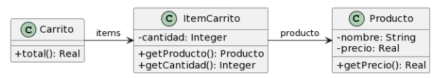

# 2.4 Carrito De Compras
## UML


## Codigo
### Producto
```java
public class Producto {
    private String nombre;
    private double precio;
    
    public double getPrecio() {
        return this.precio;
    }
}
```

### ItemCarrito
```java
public class ItemCarrito {
    private Producto producto;
    private int cantidad;
        
    public Producto getProducto() {
        return this.producto;
    }
    
    public int getCantidad() {
        return this.cantidad;
    }
}
```

### Carrito
```java
public class Carrito {
    private List<ItemCarrito> items;
    
    public double total() {
        return this.items.stream().mapToDouble(item -> item.getProducto().getPrecio() * item.getCantidad()).sum();
    }
}
```

## Malos Olores
### Feature Envy
El metodo `total()` de la clase `Carrito` al conseguir el precio de un producto no se esta delegando la responsabilidad

**Solucion**: *Move Method* creando un metodo en la clase `ItemCarrito` llamado `obtenerCantidad()` delegando la responsabilidad.

### Lazy Class
La clase `ItemCarrito` genera problemas debido a que no tiene una funcionalidad concreta que ayude en este momento
 
**Solucion**: *Inline Class* eliminando la clase `ItemCarrito` y quedandonos solo con `Producto`
