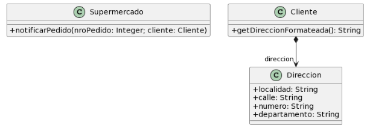

# 2.5 Envio de Pedidos
## UML


## Codigo
### Supermercado
```java
public class Supermercado {
   public void notificarPedido(long nroPedido, Cliente cliente) {
     String notificacion = MessageFormat.format(“Estimado cliente, se le informa que hemos recibido su pedido con número {0}, el cual será enviado a la dirección {1}”, new Object[] { nroPedido, cliente.getDireccionFormateada() });

     // lo imprimimos en pantalla, podría ser un mail, SMS, etc..
    System.out.println(notificacion);
  }
}
```
### Cliente
```java
public class Cliente {
    public String getDireccionFormateada() {
        return
                this.direccion.getLocalidad() + "," +
                        this.direccion.getCalle() + "," +
                        this.direccion.getNumero() + "," +
                        this.direccion.getDepartamento()
                ;
    }
}
```

## Malos Olores
### *Feature Envy*
En el método `getDireccionFormateada()` utiliza a la direccion directamente por lo tanto genera errores si la direccion no se encuentra inicializada

**Solución**: *Extract Method y Move Method* a la clase `Direccion` de dicho metodo.

### *Primitive Obsesion*
En el metodo `notificarPedido()` se tiene de parametro `long nroPedido` lo cual hace que se este requiendo mucho de un primitivo

**Solucion**: *Introduce Value Object* creando el objeto `Pedido` que contiene la variable de instancia `nroPedido` con su respectivo getter

### *Comments*
En el metodo `notificarPedido()` se hace de uso de comentarios para "aclarar" el codigo

**Solucion**: *Extract method* creando 2 metodos privados delegando las repsonsabilidades

### *Message Chain*
En el metodo `getDireccionFormateada()` se estan usando getters para formar la direccion lo cual crea una cadena de mensajes delegativos muy larga

**Solucion**: *Hide delegate*, eliminando los getters en `Direccion`
