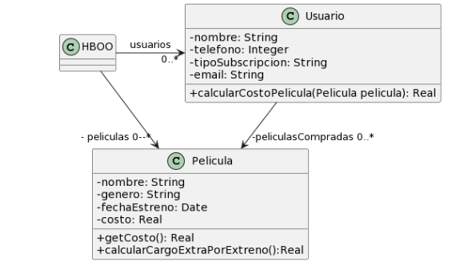

# 2.6 Peliculas
## UML


## Codigo
### HBOO
```java
public class HBOO { }
```

### Pelicula
```java
public class Pelicula {
    LocalDate fechaEstreno;
    // ...

    public double getCosto() {
   	 return this.costo;
    }
    
    public double calcularCargoExtraPorEstreno(){
	// Si la Película se estrenó 30 días antes de la fecha actual, retorna un cargo de 0$, caso contrario, retorna un cargo extra de 300$
   	return (ChronoUnit.DAYS.between(this.fechaEstreno, LocalDate.now()) ) > 30 ? 0 : 300;
    }
}
```

### Usuario
```java
public class Usuario {
    String tipoSubscripcion;
    // ...

    public void setTipoSubscripcion(String unTipo) {
   	 this.tipoSubscripcion = unTipo;
    }
    
    public double calcularCostoPelicula(Pelicula pelicula) {
   	 double costo = 0;
   	 if (tipoSubscripcion=="Basico") {
   		 costo = pelicula.getCosto() + pelicula.calcularCargoExtraPorEstreno();
   	 }
   	 else if (tipoSubscripcion== "Familia") {
   		 costo = (pelicula.getCosto() + pelicula.calcularCargoExtraPorEstreno()) * 0.90;
   	 }
   	 else if (tipoSubscripcion=="Plus") {
   		 costo = pelicula.getCosto();
   	 }
   	 else if (tipoSubscripcion=="Premium") {
   		 costo = pelicula.getCosto() * 0.75;
   	 }
   	 return costo;
    }
}
```

## Malos Olores
### Switch Statement
En el método `calcularCostoPelicula(pelicula)` se esta usando muchos `if`s anidados para la logica del metodo

**Solucion**: Extract Method, Move Class y Replace Conditional with Polymorphism creando una clase abstracta `Suscripcion` con el metodo `calcularCostoSegunSuscripcion(pelicula)` para los 4 tipos de planes (`Basico`,`Familia`,`Plus` y `Premium`)

### Comments
En el metodo `calcularCargoExtraPorEstreno()` se usa de comentarios para "aclarar" la logica del codigo

**Solucion**: Extract Method creando los metodos privados `dsfsdfs` y `dsfsdfsd` para que el codigo sea mas legible

### Primitive Obsesion
En la clase `Usuario` se tiene de la variable de instancia de `tipoSubscripcion` que es un `String` pero se tiene de un objeto que clarifica las cosas

**Solucion**: Replace Data Value with Object asignando la clase abstracta `Subscripcion`

### Violando Encapsulamiento
En las clases `Usuario` y `Pelicula` se esta violando encapsulamiento debido a que las v.i. no poseen un acceso definido

**Solucion**: Poner todas las v.i. como `private`
