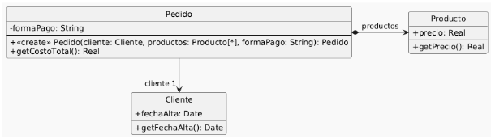

# Ejercicio 4

## UML


## Codigo
### Pedido
```java
public class Pedido {
    private Cliente cliente;
    private List<Producto> productos;
    private String formaPago;

    public Pedido(Cliente cliente, List<Producto> productos, String formaPago) {
        if (!"efectivo".equals(formaPago) &&!"6 cuotas".equals(formaPago) &&!"12 cuotas".equals(formaPago)) {
            throw new Error("Forma de pago incorrecta");
        }
        this.cliente = cliente;
        this.productos = productos;
        this.formaPago = formaPago;
    }

    public double getCostoTotal() {
        double costoProductos = 0;
        for (Producto producto : this.productos) {
        costoProductos += producto.getPrecio();
    }
    double extraFormaPago = 0;
    if ("efectivo".equals(this.formaPago)) {
        extraFormaPago = 0;
    } else if ("6 cuotas".equals(this.formaPago)) {
        extraFormaPago = costoProductos * 0.2;
    } else if ("12 cuotas".equals(this.formaPago)) {
        extraFormaPago = costoProductos * 0.5;
    }
    int añosDesdeFechaAlta = Period.between(this.cliente.getFechaAlta(), LocalDate.now()).getYears();
    // Aplicar descuento del 10% si el cliente tiene más de 5 años de antiguedad
    if (añosDesdeFechaAlta > 5) {
        return (costoProductos + extraFormaPago) * 0.9;
    }
    return costoProductos + extraFormaPago;
    }
}
```

### Producto
```java
public class Producto {
    private double precio;
    public double getPrecio() {
        return this.precio;
    }
}
```

### Cliente
```java
public class Cliente {
    private LocalDate fechaAlta;
    public LocalDate getFechaAlta() {
        return this.fechaAlta;
    }
}
```

## UML Revisado
